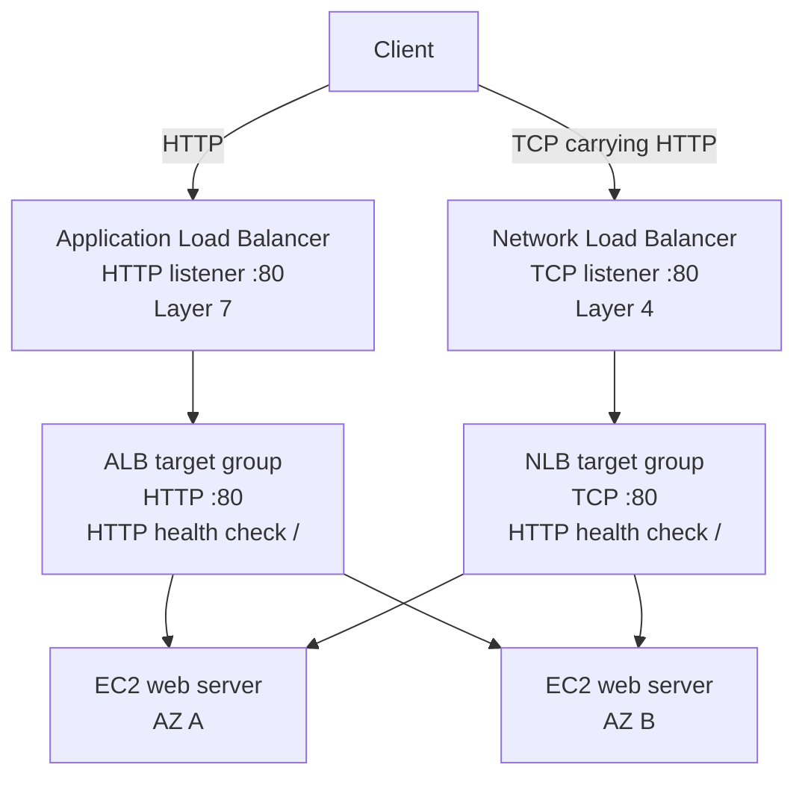

# Elastic Load Balancing with ALB and NLB: build the request path, then prove it

## Why this lab exists

A load balancer is not the backend application. It is a controlled traffic entry point that connects a listener to a target group, checks target health, and forwards requests only to eligible targets.

This lab builds **two independent public request paths** to the same two EC2 web servers:

```text
Client
  ├── HTTP :80 → Application Load Balancer → HTTP target group → EC2 targets
  └── TCP  :80 → Network Load Balancer    → TCP target group  → EC2 targets
```

The reusable operating pattern is:

```text
select scope → place across AZs → secure the boundaries
→ create the application → create target groups
→ register targets → create load balancers
→ connect listeners → verify health → test externally
→ read configuration back → clean up in dependency order
```

The examples use placeholders only. They contain no credentials, account identifiers, instance IDs, public IP addresses, ARNs, or live DNS names.

## Learning objectives

By the end, you should be able to:

- Explain the difference between an ALB and an NLB in this design.
- Trace a request from a client through a listener, target group, health check, and EC2 service.
- Use security-group references to protect the backend without opening EC2 HTTP to the world.
- Recognize why a registered target can still be `unused`.
- Separate control-plane evidence (`active`, listener exists, target is `healthy`) from data-plane evidence (a real `curl` request succeeds).
- Read attributes back after changing them instead of trusting a successful mutation response.
- Delete the resources in an order that respects dependencies and verify that active resources are gone.

## Environment and safety

- AWS CLI v2 with an authenticated named profile
- One explicitly selected AWS Region
- A VPC with at least two subnets in different Availability Zones
- Amazon Linux 2023 `x86_64` AMI
- Two disposable `t3.micro` EC2 instances
- Local macOS Terminal
- No SSH exposure is required

ALB, NLB, EC2, and public IPv4 resources can incur charges while they exist. Use a unique project prefix, keep the lab short-lived, and treat cleanup verification as a required lab gate.

## Architecture: two front doors, one backend pair



### The security boundary

The lab uses three security groups:

| Security group | Inbound rule | Reason |
| --- | --- | --- |
| ALB | Public TCP/80 | Clients must reach the ALB listener |
| NLB | Public TCP/80 | Clients must reach the NLB listener |
| EC2 | TCP/80 from the ALB and NLB security groups only | Backends trust the load balancers, not the whole internet |

The EC2 instances are not directly reachable from the public internet on port 80. Security-group references make the intended relationship explicit and avoid hard-coding backend IP ranges.

### ALB versus NLB

| Question | ALB | NLB |
| --- | --- | --- |
| Main layer | Layer 7, application-aware | Layer 4, transport-aware |
| Listener | HTTP/80 | TCP/80 |
| Target group | HTTP/80 | TCP/80 |
| Health check | HTTP `/` | HTTP `/` in this lab, even though forwarding is TCP |
| Demonstrated attribute | Cookie stickiness with `lb_cookie` | Client-IP preservation |
| Mental model | Makes decisions from HTTP requests | Moves connections with minimal protocol interpretation |

The two target groups use the same EC2 instances but remain separate because their backend protocols and load-balancer relationships are different.

## Stage 0: select the AWS scope

### Why this stage exists

AWS resources are regional. A correct command sent with the wrong profile or Region can create resources in a place you are not watching, making verification and cleanup unreliable.

### Set and verify the scope

```bash
set -euo pipefail
export AWS_PROFILE="<your-named-profile>"
export AWS_REGION="<your-region>"

: "${AWS_PROFILE:?Set AWS_PROFILE to your exact configured profile name}"
: "${AWS_REGION:?Set AWS_REGION before continuing}"

aws sts get-caller-identity \
  --profile "$AWS_PROFILE" \
  --region "$AWS_REGION" \
  --output json

aws configure get region --profile "$AWS_PROFILE"
```

The identity call proves authentication. The configuration query confirms the profile's default Region, but every later command still passes `--region` explicitly so the scope is visible in the command itself.

**Read-back gate:** identity succeeds and the Region matches the intended lab Region.

## Stage 1: discover the VPC and two Availability Zones

### Why this stage exists

Multi-AZ placement reduces dependence on one failure domain. The important fact is not simply that two subnet IDs exist; both must belong to the intended VPC and be in different AZs.

```bash
export VPC_ID="<vpc-id>"
export SUBNET_A_ID="<subnet-in-az-a>"
export SUBNET_B_ID="<subnet-in-az-b>"

aws ec2 describe-subnets \
  --subnet-ids "$SUBNET_A_ID" "$SUBNET_B_ID" \
  --profile "$AWS_PROFILE" \
  --region "$AWS_REGION" \
  --query 'Subnets[].{Subnet:SubnetId,AZ:AvailabilityZone,VPC:VpcId,PublicIPOnLaunch:MapPublicIpOnLaunch}' \
  --output table
```

Also inspect the associated route tables. Public IP assignment alone does not create an internet route; the subnet needs a route to an internet gateway for a disposable host that must install packages from the internet.

**Read-back gate:** two subnets, one VPC, two different AZs, and an intentional route design.

## Stage 2: create the security groups

### Why this stage exists

The public load balancers and the backend instances have different trust requirements. Separate groups let the rules express that difference.

```bash
export PROJECT_NAME="<unique-project-name>"

ALB_SG_ID="$(aws ec2 create-security-group \
  --group-name "${PROJECT_NAME}-alb-sg" \
  --description "Public HTTP entry for ALB" \
  --vpc-id "$VPC_ID" \
  --profile "$AWS_PROFILE" --region "$AWS_REGION" \
  --query GroupId --output text)"

NLB_SG_ID="$(aws ec2 create-security-group \
  --group-name "${PROJECT_NAME}-nlb-sg" \
  --description "Public TCP entry for NLB" \
  --vpc-id "$VPC_ID" \
  --profile "$AWS_PROFILE" --region "$AWS_REGION" \
  --query GroupId --output text)"

EC2_SG_ID="$(aws ec2 create-security-group \
  --group-name "${PROJECT_NAME}-ec2-sg" \
  --description "HTTP only from the load balancers" \
  --vpc-id "$VPC_ID" \
  --profile "$AWS_PROFILE" --region "$AWS_REGION" \
  --query GroupId --output text)"
```

Add public HTTP only to the two load-balancer groups. Add backend HTTP using security-group references:

```bash
aws ec2 authorize-security-group-ingress \
  --group-id "$ALB_SG_ID" --protocol tcp --port 80 --cidr 0.0.0.0/0 \
  --profile "$AWS_PROFILE" --region "$AWS_REGION"

aws ec2 authorize-security-group-ingress \
  --group-id "$NLB_SG_ID" --protocol tcp --port 80 --cidr 0.0.0.0/0 \
  --profile "$AWS_PROFILE" --region "$AWS_REGION"

aws ec2 authorize-security-group-ingress \
  --group-id "$EC2_SG_ID" --protocol tcp --port 80 --source-group "$ALB_SG_ID" \
  --profile "$AWS_PROFILE" --region "$AWS_REGION"

aws ec2 authorize-security-group-ingress \
  --group-id "$EC2_SG_ID" --protocol tcp --port 80 --source-group "$NLB_SG_ID" \
  --profile "$AWS_PROFILE" --region "$AWS_REGION"
```

No public SSH rule is needed. A rule can be added only when a separate management design requires it and its source is constrained.

**Read-back gate:** ALB and NLB allow public TCP/80; EC2 allows TCP/80 only from the two load-balancer groups.

## Stage 3: launch the two web servers

### Why this stage exists

The load balancers need real targets that return a distinguishable response. Each server renders its instance ID and AZ so repeated endpoint requests can show which backend responded.

Create a user-data file locally. This script runs on EC2, not on the Mac:

```bash
cat > "$HOME/elb-user-data.sh" <<'EOF'
#!/bin/bash
set -e

dnf install -y httpd
systemctl enable --now httpd

token="$(curl -sS -X PUT http://169.254.169.254/latest/api/token \
  -H 'X-aws-ec2-metadata-token-ttl-seconds: 21600')"
instance_id="$(curl -sS -H "X-aws-ec2-metadata-token: ${token}" \
  http://169.254.169.254/latest/meta-data/instance-id)"
az="$(curl -sS -H "X-aws-ec2-metadata-token: ${token}" \
  http://169.254.169.254/latest/meta-data/placement/availability-zone)"

cat > /var/www/html/index.html <<HTML
<!doctype html>
<html><body>
<h1>Elastic Load Balancing lab backend</h1>
<p>Serving instance: ${instance_id}</p>
<p>Availability Zone: ${az}</p>
</body></html>
HTML
EOF
chmod 700 "$HOME/elb-user-data.sh"
```

The bootstrap uses IMDSv2 to identify the server. It installs Apache, starts it, and writes a small HTML response. The response is deliberately simple: the purpose is to prove the traffic path, not to build an application.

Resolve the latest Amazon Linux 2023 AMI through the public SSM parameter, then launch one instance per subnet:

```bash
AMI_ID="$(aws ssm get-parameter \
  --name /aws/service/ami-amazon-linux-latest/al2023-ami-kernel-default-x86_64 \
  --profile "$AWS_PROFILE" --region "$AWS_REGION" \
  --query Parameter.Value --output text)"

INSTANCE_1_ID="$(aws ec2 run-instances \
  --image-id "$AMI_ID" --instance-type t3.micro \
  --subnet-id "$SUBNET_A_ID" --security-group-ids "$EC2_SG_ID" \
  --associate-public-ip-address \
  --metadata-options 'HttpTokens=required,HttpEndpoint=enabled,HttpPutResponseHopLimit=2' \
  --user-data "file://$HOME/elb-user-data.sh" \
  --tag-specifications "ResourceType=instance,Tags=[{Key=Name,Value=${PROJECT_NAME}-a}]" \
  --profile "$AWS_PROFILE" --region "$AWS_REGION" \
  --query 'Instances[0].InstanceId' --output text)"

INSTANCE_2_ID="$(aws ec2 run-instances \
  --image-id "$AMI_ID" --instance-type t3.micro \
  --subnet-id "$SUBNET_B_ID" --security-group-ids "$EC2_SG_ID" \
  --associate-public-ip-address \
  --metadata-options 'HttpTokens=required,HttpEndpoint=enabled,HttpPutResponseHopLimit=2' \
  --user-data "file://$HOME/elb-user-data.sh" \
  --tag-specifications "ResourceType=instance,Tags=[{Key=Name,Value=${PROJECT_NAME}-b}]" \
  --profile "$AWS_PROFILE" --region "$AWS_REGION" \
  --query 'Instances[0].InstanceId' --output text)"

aws ec2 wait instance-running \
  --instance-ids "$INSTANCE_1_ID" "$INSTANCE_2_ID" \
  --profile "$AWS_PROFILE" --region "$AWS_REGION"

aws ec2 describe-instances \
  --instance-ids "$INSTANCE_1_ID" "$INSTANCE_2_ID" \
  --profile "$AWS_PROFILE" --region "$AWS_REGION" \
  --query 'Reservations[].Instances[].{Instance:InstanceId,State:State.Name,AZ:Placement.AvailabilityZone,Subnet:SubnetId}' \
  --output table
```

`running` is only a lifecycle state. It does not prove that user data finished, Apache is listening, or the public path works. Allow bootstrap time and use the target-health gate later.

**Read-back gate:** two instances are `running`, in different AZs, with the intended security group and subnet placement.

## Stage 4: create target groups and register targets

### Why this stage exists

A target group is the backend contract: protocol, port, health check, registered targets, and routing attributes. The ALB and NLB need separate contracts even though they share the same instances.

```bash
ALB_TG_ARN="$(aws elbv2 create-target-group \
  --name "${PROJECT_NAME}-alb-tg" --protocol HTTP --port 80 \
  --target-type instance --vpc-id "$VPC_ID" \
  --health-check-protocol HTTP --health-check-path / \
  --profile "$AWS_PROFILE" --region "$AWS_REGION" \
  --query 'TargetGroups[0].TargetGroupArn' --output text)"

NLB_TG_ARN="$(aws elbv2 create-target-group \
  --name "${PROJECT_NAME}-nlb-tg" --protocol TCP --port 80 \
  --target-type instance --vpc-id "$VPC_ID" \
  --health-check-protocol HTTP --health-check-path / \
  --profile "$AWS_PROFILE" --region "$AWS_REGION" \
  --query 'TargetGroups[0].TargetGroupArn' --output text)"

aws elbv2 register-targets \
  --target-group-arn "$ALB_TG_ARN" \
  --targets "Id=$INSTANCE_1_ID,Port=80" "Id=$INSTANCE_2_ID,Port=80" \
  --profile "$AWS_PROFILE" --region "$AWS_REGION"

aws elbv2 register-targets \
  --target-group-arn "$NLB_TG_ARN" \
  --targets "Id=$INSTANCE_1_ID,Port=80" "Id=$INSTANCE_2_ID,Port=80" \
  --profile "$AWS_PROFILE" --region "$AWS_REGION"
```

The ALB forwards HTTP. The NLB forwards TCP, but its health check uses HTTP `/` so the lab still verifies that Apache returns a real application response.

A target group can report `unused` before a listener uses it. That state means the target group is not currently receiving traffic through a listener; it is not, by itself, proof that the EC2 service failed.

**Read-back gate:** both target groups exist with the intended protocol, port, and health-check settings, and both instances are registered.

## Stage 5: create the load balancers

### Why this stage exists

These are the public entry points. Both span the two selected subnets, but one interprets HTTP and the other forwards at TCP level.

```bash
ALB_ARN="$(aws elbv2 create-load-balancer \
  --name "${PROJECT_NAME}-alb" --type application \
  --scheme internet-facing --ip-address-type ipv4 \
  --subnets "$SUBNET_A_ID" "$SUBNET_B_ID" \
  --security-groups "$ALB_SG_ID" \
  --profile "$AWS_PROFILE" --region "$AWS_REGION" \
  --query 'LoadBalancers[0].LoadBalancerArn' --output text)"

NLB_ARN="$(aws elbv2 create-load-balancer \
  --name "${PROJECT_NAME}-nlb" --type network \
  --scheme internet-facing --ip-address-type ipv4 \
  --subnets "$SUBNET_A_ID" "$SUBNET_B_ID" \
  --security-groups "$NLB_SG_ID" \
  --profile "$AWS_PROFILE" --region "$AWS_REGION" \
  --query 'LoadBalancers[0].LoadBalancerArn' --output text)"
```

Attach the NLB security group during creation. Treat that as a design decision, not a cosmetic detail: the NLB needs its inbound boundary from the moment it is exposed.

**Read-back gate:** both load balancers become `active` and report the intended AZs.

## Stage 6: create the matching listeners

### Why this stage exists

A target group can be healthy and still receive no traffic if no listener forwards to it. The listener is the missing link between public entry and backend contract.

```bash
aws elbv2 create-listener \
  --load-balancer-arn "$ALB_ARN" \
  --protocol HTTP --port 80 \
  --default-actions "Type=forward,TargetGroupArn=$ALB_TG_ARN" \
  --profile "$AWS_PROFILE" --region "$AWS_REGION"

aws elbv2 create-listener \
  --load-balancer-arn "$NLB_ARN" \
  --protocol TCP --port 80 \
  --default-actions "Type=forward,TargetGroupArn=$NLB_TG_ARN" \
  --profile "$AWS_PROFILE" --region "$AWS_REGION"
```

The protocol pairing is intentional: HTTP/80 → ALB target group, and TCP/80 → NLB target group. Do not cross-wire the target groups.

**Read-back gate:** one HTTP listener forwards to the ALB target group and one TCP listener forwards to the NLB target group.

## Stage 7: verify target health

### Why this stage exists

Creation responses prove that AWS accepted a resource mutation. Target health proves that the configured health checker can reach the backend service.

```bash
aws elbv2 describe-target-health \
  --target-group-arn "$ALB_TG_ARN" \
  --profile "$AWS_PROFILE" --region "$AWS_REGION" \
  --query 'TargetHealthDescriptions[].{Target:Target.Id,State:TargetHealth.State,Reason:TargetHealth.Reason}' \
  --output table

aws elbv2 describe-target-health \
  --target-group-arn "$NLB_TG_ARN" \
  --profile "$AWS_PROFILE" --region "$AWS_REGION" \
  --query 'TargetHealthDescriptions[].{Target:Target.Id,State:TargetHealth.State,Reason:TargetHealth.Reason}' \
  --output table
```

**Expected evidence:** two `healthy` targets in each target group.

If a target is unhealthy, inspect layers in this order:

1. Is Apache installed and listening on port 80?
2. Is the target group using the intended port and health path?
3. Does the EC2 group allow HTTP from the relevant load-balancer group?
4. Does the subnet route permit the intended return path?
5. Is the listener connected to the target group?

Do not change the load balancer first just because the symptom appears at the load balancer.

## Stage 8: configure and read back attributes

The verified lab configuration was:

| Target group | Attribute | Intended value | Why it matters |
| --- | --- | --- | --- |
| ALB | Stickiness | Enabled, `lb_cookie` | Keeps a client associated with a target for the cookie duration |
| ALB | Cookie duration | `86400` seconds | Makes the configured session behavior explicit |
| ALB/NLB | Deregistration delay | `30` seconds | Controls connection draining during removal |
| NLB | Client IP preservation | Enabled | Retains source-client information when supported |

Apply and verify the attributes:

```bash
aws elbv2 modify-target-group-attributes \
  --target-group-arn "$ALB_TG_ARN" \
  --attributes \
    Key=stickiness.enabled,Value=true \
    Key=stickiness.type,Value=lb_cookie \
    Key=stickiness.lb_cookie.duration_seconds,Value=86400 \
    Key=deregistration_delay.timeout_seconds,Value=30 \
  --profile "$AWS_PROFILE" --region "$AWS_REGION"

aws elbv2 modify-target-group-attributes \
  --target-group-arn "$NLB_TG_ARN" \
  --attributes \
    Key=preserve_client_ip.enabled,Value=true \
    Key=deregistration_delay.timeout_seconds,Value=30 \
  --profile "$AWS_PROFILE" --region "$AWS_REGION"

aws elbv2 describe-target-group-attributes \
  --target-group-arn "$ALB_TG_ARN" \
  --profile "$AWS_PROFILE" --region "$AWS_REGION" \
  --query 'Attributes[?Key==`stickiness.enabled` || Key==`stickiness.type` || Key==`stickiness.lb_cookie.duration_seconds` || Key==`deregistration_delay.timeout_seconds`]' \
  --output table

aws elbv2 describe-target-group-attributes \
  --target-group-arn "$NLB_TG_ARN" \
  --profile "$AWS_PROFILE" --region "$AWS_REGION" \
  --query 'Attributes[?Key==`preserve_client_ip.enabled` || Key==`deregistration_delay.timeout_seconds`]' \
  --output table
```

The first NLB read-back in the observed run still showed the default deregistration delay, so the mutation was corrected and read back again. This is the operational lesson: a successful API response is not the same as verified final state.

## Stage 9: test the real public paths

Resolve DNS names from the load balancer ARNs instead of copying stale values:

```bash
ALB_DNS="$(aws elbv2 describe-load-balancers \
  --load-balancer-arns "$ALB_ARN" \
  --profile "$AWS_PROFILE" --region "$AWS_REGION" \
  --query 'LoadBalancers[0].DNSName' --output text)"

NLB_DNS="$(aws elbv2 describe-load-balancers \
  --load-balancer-arns "$NLB_ARN" \
  --profile "$AWS_PROFILE" --region "$AWS_REGION" \
  --query 'LoadBalancers[0].DNSName' --output text)"

for attempt in 1 2 3 4 5; do
  printf 'ALB attempt %s\n' "$attempt"
  curl --fail --silent --show-error --max-time 10 "http://${ALB_DNS}/"
done

for attempt in 1 2 3 4 5; do
  printf 'NLB attempt %s\n' "$attempt"
  curl --fail --silent --show-error --max-time 10 \
    --write-out '\nHTTP status: %{http_code}\n' "http://${NLB_DNS}/"
done
```

### What the evidence means

- **ALB request succeeds:** the HTTP listener, ALB target group, target health, security boundary, route, and Apache response worked for that request.
- **NLB request succeeds:** the TCP listener, NLB target group, target health, security boundary, route, and Apache response worked for that request.
- **Different backend identities appear:** more than one target was reached. This does not prove equal distribution.
- **HTTP 200 appears:** the tested request returned successfully. It does not prove TLS, capacity, long-term availability, or production readiness.

## Observed execution evidence

The lab was executed and then cleaned up. The verified outcomes were:

- ALB and NLB both became `active`.
- Both target groups reported two `healthy` targets.
- The two EC2 targets were `running` and placed in separate Availability Zones during testing.
- Five ALB requests returned the expected backend page and reached both backend instances/AZs.
- Five NLB requests returned HTTP 200 and reached both backend instances/AZs.
- ALB cookie stickiness and NLB client-IP preservation were read back.
- The final deregistration delay was read back as 30 seconds for both target groups after correcting the first NLB attribute attempt.
- Cleanup verification found no remaining active lab load balancers, listeners, target groups, instances, or security groups. Terminated EC2 history can remain in AWS records; active resources must not.

## Troubleshooting by layer

| Symptom | Inspect first | Safe interpretation |
| --- | --- | --- |
| `Unable to locate credentials` | Profile and `sts get-caller-identity` | Authentication scope is unresolved; do not create anything |
| `AccessDenied` | IAM action and selected profile/Region | Authentication succeeded but authorization may not |
| Target is `unused` | Listener → target-group mapping | The group may be healthy but not connected to a listener |
| Target is `unhealthy` | Apache, port, EC2 SG source, route, then health settings | The load balancer is reporting a backend-path failure |
| ALB returns 503 | Target health and listener mapping | No healthy eligible target was available to the ALB |
| NLB times out | NLB SG, EC2 SG, route, and Apache port 80 | TCP forwarding does not remove network-policy requirements |
| Only one backend appears | Stickiness and sample size | A short sample does not prove a distribution failure |
| Attribute remains default | Exact target-group read-back | Repeat the focused mutation; do not trust the request's success alone |
| Resource is missing from CLI | Profile and Region | AWS inventory is scope-dependent |
| Security-group deletion fails | Remaining ENIs, load balancers, listeners, instances, or target groups | Delete dependencies first |

## Cleanup: delete in dependency order

Load balancers depend on listeners; listeners depend on target groups; security groups can remain attached to network interfaces until dependent resources are gone. Use the exact IDs captured during setup.

```bash
# 1. Delete listeners first.
aws elbv2 delete-listener --listener-arn "$ALB_LISTENER_ARN" \
  --profile "$AWS_PROFILE" --region "$AWS_REGION"
aws elbv2 delete-listener --listener-arn "$NLB_LISTENER_ARN" \
  --profile "$AWS_PROFILE" --region "$AWS_REGION"

# 2. Delete the load balancers.
aws elbv2 delete-load-balancer --load-balancer-arn "$ALB_ARN" \
  --profile "$AWS_PROFILE" --region "$AWS_REGION"
aws elbv2 delete-load-balancer --load-balancer-arn "$NLB_ARN" \
  --profile "$AWS_PROFILE" --region "$AWS_REGION"

# 3. Delete target groups after the load balancers are gone.
aws elbv2 delete-target-group --target-group-arn "$ALB_TG_ARN" \
  --profile "$AWS_PROFILE" --region "$AWS_REGION"
aws elbv2 delete-target-group --target-group-arn "$NLB_TG_ARN" \
  --profile "$AWS_PROFILE" --region "$AWS_REGION"

# 4. Terminate instances, then wait for the lifecycle transition.
aws ec2 terminate-instances --instance-ids "$INSTANCE_1_ID" "$INSTANCE_2_ID" \
  --profile "$AWS_PROFILE" --region "$AWS_REGION"
aws ec2 wait instance-terminated --instance-ids "$INSTANCE_1_ID" "$INSTANCE_2_ID" \
  --profile "$AWS_PROFILE" --region "$AWS_REGION"

# 5. Delete security groups after their dependent interfaces are gone.
aws ec2 delete-security-group --group-id "$EC2_SG_ID" \
  --profile "$AWS_PROFILE" --region "$AWS_REGION"
aws ec2 delete-security-group --group-id "$ALB_SG_ID" \
  --profile "$AWS_PROFILE" --region "$AWS_REGION"
aws ec2 delete-security-group --group-id "$NLB_SG_ID" \
  --profile "$AWS_PROFILE" --region "$AWS_REGION"
```

### Cleanup verification

Require all of the following:

- No project load balancers or listeners remain.
- No project target groups remain.
- No project instances remain in an active state.
- No project security groups remain.
- Temporary local bootstrap and variable files are removed or kept outside the repository.

A clean inventory prevents ongoing resource-hour charges. It does not erase usage that AWS already recorded in billing history.

## Transferable lessons

- **Listener → target group → target health → application** is the core diagnostic chain.
- ALB is appropriate when HTTP-aware routing is useful; NLB is appropriate when transport-level forwarding and source-IP behavior matter.
- A target group is not merely a list of servers; it is a protocol, port, health, membership, and attribute contract.
- `running`, `active`, `registered`, and `healthy` are different claims and require different read-backs.
- Security-group references communicate trust relationships more precisely than broad backend CIDRs.
- Configuration mutations must be verified by reading the stored state.
- Cleanup is part of the implementation, not an afterthought.

## Sources

- [CloudProjects: Elastic Load Balancing with ALB and NLB](https://github.com/mzazon/cloud-projects/tree/main/aws/elastic-load-balancing-alb-nlb)
- [AWS: Security groups for Application Load Balancers](https://docs.aws.amazon.com/elasticloadbalancing/latest/application/load-balancer-update-security-groups.html)
- [AWS: Security groups for Network Load Balancers](https://docs.aws.amazon.com/elasticloadbalancing/latest/network/load-balancer-security-groups.html)
- [AWS: Target groups](https://docs.aws.amazon.com/elasticloadbalancing/latest/application/load-balancer-target-groups.html)
- [AWS: Create a Network Load Balancer](https://docs.aws.amazon.com/elasticloadbalancing/latest/network/create-network-load-balancer.html)
