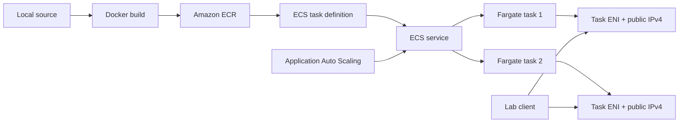

# Running Containers with AWS Fargate: connect the image, task, service, and runtime

## Goal

This lab deploys a small containerized HTTP application on Amazon ECS using AWS Fargate. The transferable pattern is:

```text
application source
  → Docker image
  → Amazon ECR repository
  → ECS task definition
  → ECS service
  → Fargate tasks with ENIs
  → application health and HTTP verification
  → Application Auto Scaling
```

Fargate removes the need to manage EC2 container hosts, but it does not remove the need to understand IAM, image architecture, networking, security groups, task definitions, health checks, service scheduling, or cleanup.

This artifact deliberately uses direct public task IPs for a small lab. It does **not** deploy the Application Load Balancer shown in the upstream recipe's conceptual diagram. The next production-minded variant should place tasks in private subnets behind an ALB.

## Environment and safety

- AWS CLI v2 with a configured named profile
- Docker Desktop or another reachable Docker engine
- `jq` and `curl`
- One explicitly selected AWS Region
- A default VPC with at least two public subnets and a route to an Internet Gateway
- Permissions for ECS, ECR, IAM, EC2/VPC, CloudWatch Logs, and Application Auto Scaling
- A disposable lab account or tightly scoped IAM identity

Fargate tasks, public IPv4 addresses, ECR storage, CloudWatch Logs, and data transfer can incur charges. Stop the service and verify cleanup before leaving the lab. The exact amount depends on Region, task size, runtime, and account pricing; this README does not estimate a bill.

The security group uses the current public IPv4 address as a `/32` by default. Widening the application rule to `0.0.0.0/0` is intentionally left as an explicit lab-only override, not a production recommendation.

## Architecture



The dependency chain matters:

- **ECR** stores the image that Fargate must pull.
- **The task execution role** lets the ECS/Fargate agent pull from ECR and write `awslogs` output; it is not automatically the role used by application code inside the container.
- **The task definition** is the runtime blueprint: image, CPU, memory, network mode, architecture, port mapping, logs, and health check.
- **The service** maintains a desired number of task replicas and replaces failed tasks.
- **Fargate** supplies isolated compute and a task-level elastic network interface.
- **Application Auto Scaling** changes the service desired count in response to metrics.

## Stage 0: preflight and durable variables

### Why this stage exists

AWS resources are scoped to an identity and Region, while Docker images are scoped to a local engine and CPU architecture. Establishing both scopes first prevents the two most expensive classes of mistake: creating resources in the wrong account/Region and registering a task definition that cannot run the image.

Run this in a real terminal. The block is read-only except for creating a local variables file.

```bash
set -euo pipefail

export AWS_PROFILE="${AWS_PROFILE:?Set AWS_PROFILE to your configured named profile}"
export AWS_REGION="${AWS_REGION:?Set AWS_REGION to the intended AWS Region}"
export AWS_DEFAULT_REGION="$AWS_REGION"

aws sts get-caller-identity \
  --profile "$AWS_PROFILE" \
  --region "$AWS_REGION" \
  --query '{Arn:Arn,Account:Account}' \
  --output json

aws configure get region --profile "$AWS_PROFILE"
docker --version
docker info >/dev/null
jq --version
curl --version | head -n 1
```

Do not publish the identity JSON, account number, or credentials. The identity call proves authentication only; it does not prove authorization for ECS, ECR, IAM, EC2, Logs, or Auto Scaling.

Create names once and preserve them across retries. The variables file is local working state and must never be committed.

```bash
export LAB_SUFFIX="${LAB_SUFFIX:-$(openssl rand -hex 3)}"
export LAB_DIR="${LAB_DIR:-$HOME/fargate-demo-$LAB_SUFFIX}"
export CLUSTER_NAME="fargate-demo-$LAB_SUFFIX"
export REPOSITORY_NAME="demo-app-$LAB_SUFFIX"
export SERVICE_NAME="demo-service-$LAB_SUFFIX"
export TASK_FAMILY="demo-task-$LAB_SUFFIX"
export EXECUTION_ROLE_NAME="ecsTaskExecutionRole-$LAB_SUFFIX"
export LOG_GROUP_NAME="/ecs/$TASK_FAMILY"
export SECURITY_GROUP_NAME="fargate-demo-sg-$LAB_SUFFIX"
export IMAGE_NAME="fargate-demo:$LAB_SUFFIX"
export IMAGE_TAG="latest"
export IMAGE_PLATFORM="${IMAGE_PLATFORM:-linux/arm64}"

case "$IMAGE_PLATFORM" in
  linux/arm64) export ECS_CPU_ARCH="ARM64" ;;
  linux/amd64) export ECS_CPU_ARCH="X86_64" ;;
  *) printf 'Unsupported IMAGE_PLATFORM: %s\n' "$IMAGE_PLATFORM" >&2; exit 1 ;;
esac

mkdir -p "$LAB_DIR"
chmod 700 "$LAB_DIR"
printf '%s\n' \
  "export AWS_PROFILE=$(printf '%q' "$AWS_PROFILE")" \
  "export AWS_REGION=$(printf '%q' "$AWS_REGION")" \
  "export AWS_DEFAULT_REGION=$(printf '%q' "$AWS_DEFAULT_REGION")" \
  "export LAB_SUFFIX=$(printf '%q' "$LAB_SUFFIX")" \
  "export LAB_DIR=$(printf '%q' "$LAB_DIR")" \
  "export CLUSTER_NAME=$(printf '%q' "$CLUSTER_NAME")" \
  "export REPOSITORY_NAME=$(printf '%q' "$REPOSITORY_NAME")" \
  "export SERVICE_NAME=$(printf '%q' "$SERVICE_NAME")" \
  "export TASK_FAMILY=$(printf '%q' "$TASK_FAMILY")" \
  "export EXECUTION_ROLE_NAME=$(printf '%q' "$EXECUTION_ROLE_NAME")" \
  "export LOG_GROUP_NAME=$(printf '%q' "$LOG_GROUP_NAME")" \
  "export SECURITY_GROUP_NAME=$(printf '%q' "$SECURITY_GROUP_NAME")" \
  "export IMAGE_NAME=$(printf '%q' "$IMAGE_NAME")" \
  "export IMAGE_TAG=$(printf '%q' "$IMAGE_TAG")" \
  "export IMAGE_PLATFORM=$(printf '%q' "$IMAGE_PLATFORM")" \
  "export ECS_CPU_ARCH=$(printf '%q' "$ECS_CPU_ARCH")" \
  > "$LAB_DIR/vars.sh"
chmod 600 "$LAB_DIR/vars.sh"
source "$LAB_DIR/vars.sh"
```

**Read back:** the profile, Region, suffix, image platform, and derived architecture are non-empty. The variables file exists locally with restrictive permissions.

## Stage 1: build and test the application locally

### Why this stage exists

A Fargate failure is difficult to diagnose if the application or image has never worked locally. The local test isolates application and Docker problems before AWS networking and IAM are introduced.

The public repository includes these supporting files:

- `app/app.js` exposes `/` and `/health` and binds to `0.0.0.0:3000`.
- `app/package.json` declares the Express dependency.
- `app/package-lock.json` makes `npm ci` reproducible.
- `app/Dockerfile` uses an Alpine Node image and runs as a non-root user.

Copy the application into the disposable local lab directory, build for the selected Linux architecture, and inspect the result.

```bash
source "$LAB_DIR/vars.sh"

cp -R app "$LAB_DIR/app"
cd "$LAB_DIR/app"

docker build \
  --platform "$IMAGE_PLATFORM" \
  --tag "$IMAGE_NAME" \
  .

printf 'Image platform: '
docker image inspect "$IMAGE_NAME" --format '{{.Os}}/{{.Architecture}}'
```

Run the container on a dedicated host port instead of assuming port 3000 is free.

```bash
export HOST_PORT="${HOST_PORT:-33000}"
export CONTAINER_NAME="fargate-local-$LAB_SUFFIX"

docker run --detach \
  --name "$CONTAINER_NAME" \
  --publish "$HOST_PORT:3000" \
  "$IMAGE_NAME"

curl --fail --silent --show-error --retry 5 --retry-delay 1 "http://127.0.0.1:$HOST_PORT/health"
printf '\n'
curl --fail --silent --show-error --retry 5 --retry-delay 1 "http://127.0.0.1:$HOST_PORT/"
printf '\n'

docker inspect "$CONTAINER_NAME" --format '{{.State.Status}}'
docker stop "$CONTAINER_NAME"
docker rm "$CONTAINER_NAME"
```

**Expected evidence:** `/health` returns JSON containing `healthy`; `/` returns the application message; Docker reports the container was running before it was stopped. A successful local response proves the application and local container path, not AWS permissions, ECR availability, or Fargate networking.

## Stage 2: create the ECS cluster and ECR repository

### Why this stage exists

ECR is the durable image source that Fargate can pull from. The ECS cluster is the scheduling boundary in which the service will place tasks. Create them only after the local image has passed its test.

```bash
source "$LAB_DIR/vars.sh"

aws ecs create-cluster \
  --profile "$AWS_PROFILE" \
  --region "$AWS_REGION" \
  --cluster-name "$CLUSTER_NAME" \
  --query 'cluster.{Name:clusterName,Status:status}' \
  --output table

aws ecr create-repository \
  --profile "$AWS_PROFILE" \
  --region "$AWS_REGION" \
  --repository-name "$REPOSITORY_NAME" \
  --encryption-configuration encryptionType=AES256 \
  --image-scanning-configuration scanOnPush=true \
  --query 'repository.{Name:repositoryName,ScanOnPush:imageScanningConfiguration.scanOnPush,Encryption:encryptionConfiguration.encryptionType}' \
  --output table

export REPOSITORY_URI="$(aws ecr describe-repositories \
  --profile "$AWS_PROFILE" \
  --region "$AWS_REGION" \
  --repository-names "$REPOSITORY_NAME" \
  --query 'repositories[0].repositoryUri' \
  --output text)"
export REGISTRY_HOST="${REPOSITORY_URI%%/*}"
```

If a rerun reports that a resource already exists, stop and inspect it rather than generating a new suffix. Partial success is state to reconcile, not permission to create duplicates.

## Stage 3: tag, authenticate, push, and verify the image

### Why this stage exists

Docker pushes by image reference. Tagging with the exact ECR repository URI connects the local image to the remote repository; the digest read-back proves that ECR stored a manifest for the requested tag.

```bash
source "$LAB_DIR/vars.sh"
export REPOSITORY_URI="$(aws ecr describe-repositories \
  --profile "$AWS_PROFILE" --region "$AWS_REGION" \
  --repository-names "$REPOSITORY_NAME" \
  --query 'repositories[0].repositoryUri' --output text)"
export REGISTRY_HOST="${REPOSITORY_URI%%/*}"

aws ecr get-login-password \
  --profile "$AWS_PROFILE" \
  --region "$AWS_REGION" |
  docker login \
    --username AWS \
    --password-stdin "$REGISTRY_HOST"

docker tag "$IMAGE_NAME" "$REPOSITORY_URI:$IMAGE_TAG"
docker push "$REPOSITORY_URI:$IMAGE_TAG"

aws ecr describe-images \
  --profile "$AWS_PROFILE" \
  --region "$AWS_REGION" \
  --repository-name "$REPOSITORY_NAME" \
  --image-ids imageTag="$IMAGE_TAG" \
  --query 'imageDetails[0].{Tag:imageTags[0],Digest:imageDigest,Platform:imageManifestMediaType}' \
  --output table
```

**Expected evidence:** the image has a non-empty ECR digest. Docker login or push output alone is not the final verification. After the push, the cached registry credential can be removed with `docker logout "$REGISTRY_HOST"`; this does not delete the remote image.

## Stage 4: create the task-execution role and log group

### Why this stage exists

The Fargate agent needs temporary AWS permissions to pull the private ECR image and write container logs. The trust policy answers **who may assume the role**; the attached managed policy answers **what common ECS execution actions are allowed**.

Create the trust policy locally. It contains no secret.

```bash
source "$LAB_DIR/vars.sh"

cat > "$LAB_DIR/task-execution-trust-policy.json" <<'JSON'
{
  "Version": "2012-10-17",
  "Statement": [
    {
      "Effect": "Allow",
      "Principal": {"Service": "ecs-tasks.amazonaws.com"},
      "Action": "sts:AssumeRole"
    }
  ]
}
JSON

jq empty "$LAB_DIR/task-execution-trust-policy.json"

aws iam create-role \
  --profile "$AWS_PROFILE" \
  --role-name "$EXECUTION_ROLE_NAME" \
  --assume-role-policy-document "file://$LAB_DIR/task-execution-trust-policy.json" \
  --query 'Role.RoleName' \
  --output text

aws iam attach-role-policy \
  --profile "$AWS_PROFILE" \
  --role-name "$EXECUTION_ROLE_NAME" \
  --policy-arn arn:aws:iam::aws:policy/service-role/AmazonECSTaskExecutionRolePolicy

aws iam wait role-exists \
  --profile "$AWS_PROFILE" \
  --role-name "$EXECUTION_ROLE_NAME"

export EXECUTION_ROLE_ARN="$(aws iam get-role \
  --profile "$AWS_PROFILE" \
  --role-name "$EXECUTION_ROLE_NAME" \
  --query 'Role.Arn' --output text)"

aws logs create-log-group \
  --profile "$AWS_PROFILE" \
  --region "$AWS_REGION" \
  --log-group-name "$LOG_GROUP_NAME"
```

**Read back:** the role exists and the log group exists. The task execution role is distinct from an optional `taskRoleArn`, which would be used by application code inside the container.

## Stage 5: inspect network placement and create a task definition

### Why this stage exists

Fargate tasks using `awsvpc` receive their own network interfaces. The task definition must describe a valid Fargate size, Linux architecture, container port, logs, and health check. The selected subnets must have the route needed for this public-IP lab.

Discover the default VPC and public subnets. The query is deliberately read-only.

```bash
source "$LAB_DIR/vars.sh"

export DEFAULT_VPC_ID="$(aws ec2 describe-vpcs \
  --profile "$AWS_PROFILE" --region "$AWS_REGION" \
  --filters Name=is-default,Values=true \
  --query 'Vpcs[0].VpcId' --output text)"

export SUBNET_IDS="$(aws ec2 describe-subnets \
  --profile "$AWS_PROFILE" --region "$AWS_REGION" \
  --filters Name=vpc-id,Values="$DEFAULT_VPC_ID" Name=map-public-ip-on-launch,Values=true \
  --query 'sort_by(Subnets,&AvailabilityZone)[].SubnetId' \
  --output text | tr '\t' ',')"

printf 'VPC: %s\nSubnets: %s\n' "$DEFAULT_VPC_ID" "$SUBNET_IDS"

SUBNET_COUNT="$(printf '%s' "$SUBNET_IDS" | tr ',' '\n' | awk 'NF {count++} END {print count+0}')"
if [ "$SUBNET_COUNT" -lt 2 ]; then
  printf 'Need at least two public subnets; found %s\n' "$SUBNET_COUNT" >&2
  exit 1
fi

printf '%s' "$SUBNET_IDS" | tr ',' '\n' | while IFS= read -r SUBNET_ID; do
  printf '\nSubnet %s route read-back:\n' "$SUBNET_ID"
  aws ec2 describe-route-tables \
    --profile "$AWS_PROFILE" --region "$AWS_REGION" \
    --filters Name=association.subnet-id,Values="$SUBNET_ID" \
    --query 'RouteTables[].{RouteTable:RouteTableId,InternetGateway:Routes[?DestinationCidrBlock==`0.0.0.0/0`].GatewayId | [0]}' \
    --output table
done
```

The route output must show an Internet Gateway for the public-IP version. `MapPublicIpOnLaunch=true` alone is not proof of internet reachability; the route table is the separate relationship that supplies the path.

Create the task definition with `jq` so the image, role, Region, and architecture are injected as structured values rather than pasted into JSON.

```bash
source "$LAB_DIR/vars.sh"
export REPOSITORY_URI="$(aws ecr describe-repositories \
  --profile "$AWS_PROFILE" --region "$AWS_REGION" \
  --repository-names "$REPOSITORY_NAME" \
  --query 'repositories[0].repositoryUri' --output text)"
export EXECUTION_ROLE_ARN="$(aws iam get-role \
  --profile "$AWS_PROFILE" --role-name "$EXECUTION_ROLE_NAME" \
  --query 'Role.Arn' --output text)"

jq -n \
  --arg family "$TASK_FAMILY" \
  --arg image "$REPOSITORY_URI:$IMAGE_TAG" \
  --arg role "$EXECUTION_ROLE_ARN" \
  --arg region "$AWS_REGION" \
  --arg architecture "$ECS_CPU_ARCH" \
  '{
    family: $family,
    networkMode: "awsvpc",
    requiresCompatibilities: ["FARGATE"],
    cpu: "256",
    memory: "512",
    executionRoleArn: $role,
    runtimePlatform: {
      cpuArchitecture: $architecture,
      operatingSystemFamily: "LINUX"
    },
    containerDefinitions: [{
      name: "demo-container",
      image: $image,
      essential: true,
      portMappings: [{
        name: "http",
        containerPort: 3000,
        hostPort: 3000,
        protocol: "tcp"
      }],
      logConfiguration: {
        logDriver: "awslogs",
        options: {
          "awslogs-group": "/ecs/" + $family,
          "awslogs-region": $region,
          "awslogs-stream-prefix": "ecs"
        }
      },
      healthCheck: {
        command: ["CMD-SHELL", "wget --no-verbose --tries=1 --spider http://localhost:3000/health || exit 1"],
        interval: 30,
        timeout: 5,
        retries: 3,
        startPeriod: 60
      }
    }]
  }' > "$LAB_DIR/task-definition.json"

jq empty "$LAB_DIR/task-definition.json"

aws ecs register-task-definition \
  --profile "$AWS_PROFILE" \
  --region "$AWS_REGION" \
  --cli-input-json "file://$LAB_DIR/task-definition.json" \
  --query 'taskDefinition.{Family:family,Revision:revision,Image:containerDefinitions[0].image,Architecture:runtimePlatform.cpuArchitecture}' \
  --output table
```

**Expected evidence:** registration succeeds and the read-back shows the exact ECR image reference and the same architecture reported by `docker image inspect`. On Apple Silicon, `linux/arm64` paired with `ARM64` is the native path used in the observed execution. An `X86_64` task definition requires an explicitly built `linux/amd64` image instead.

## Stage 6: create the security group and ECS service

### Why this stage exists

The task ENI needs an inbound rule for the application port and outbound access for image pulls and logs. The service then turns one task definition into a continuously reconciled desired count.

Create the group and use the current public IP as the narrow source boundary.

```bash
source "$LAB_DIR/vars.sh"

export ALLOWED_CIDR="${ALLOWED_CIDR:-$(curl -fsS https://checkip.amazonaws.com)/32}"

export FARGATE_SG_ID="$(aws ec2 create-security-group \
  --profile "$AWS_PROFILE" --region "$AWS_REGION" \
  --group-name "$SECURITY_GROUP_NAME" \
  --description "Disposable Fargate lab application access" \
  --vpc-id "$DEFAULT_VPC_ID" \
  --query GroupId --output text)"

aws ec2 authorize-security-group-ingress \
  --profile "$AWS_PROFILE" --region "$AWS_REGION" \
  --group-id "$FARGATE_SG_ID" \
  --protocol tcp --port 3000 --cidr "$ALLOWED_CIDR"

printf '%s\n' \
  "export DEFAULT_VPC_ID=$(printf '%q' "$DEFAULT_VPC_ID")" \
  "export SUBNET_IDS=$(printf '%q' "$SUBNET_IDS")" \
  "export FARGATE_SG_ID=$(printf '%q' "$FARGATE_SG_ID")" \
  "export ALLOWED_CIDR=$(printf '%q' "$ALLOWED_CIDR")" \
  >> "$LAB_DIR/vars.sh"

aws ec2 describe-security-groups \
  --profile "$AWS_PROFILE" --region "$AWS_REGION" \
  --group-ids "$FARGATE_SG_ID" \
  --query 'SecurityGroups[0].{Group:GroupId,Name:GroupName,VPC:VpcId,Ingress:IpPermissions[?FromPort==`3000`].IpRanges[].CidrIp}' \
  --output table
```

`0.0.0.0/0` can be used only as a deliberate lab exception:

```bash
# Do not run this unless you explicitly accept public access to port 3000.
aws ec2 authorize-security-group-ingress \
  --profile "$AWS_PROFILE" --region "$AWS_REGION" \
  --group-id "$FARGATE_SG_ID" \
  --protocol tcp --port 3000 --cidr 0.0.0.0/0
```

Create two tasks for the service. This version uses public task IPs to make the network path visible; a production design would normally use private subnets and an ALB.

```bash
source "$LAB_DIR/vars.sh"

aws ecs create-service \
  --profile "$AWS_PROFILE" \
  --region "$AWS_REGION" \
  --cluster "$CLUSTER_NAME" \
  --service-name "$SERVICE_NAME" \
  --task-definition "$TASK_FAMILY" \
  --desired-count 2 \
  --launch-type FARGATE \
  --platform-version LATEST \
  --network-configuration "awsvpcConfiguration={subnets=[$SUBNET_IDS],securityGroups=[$FARGATE_SG_ID],assignPublicIp=ENABLED}"

aws ecs wait services-stable \
  --profile "$AWS_PROFILE" \
  --region "$AWS_REGION" \
  --cluster "$CLUSTER_NAME" \
  --services "$SERVICE_NAME"

aws ecs describe-services \
  --profile "$AWS_PROFILE" \
  --region "$AWS_REGION" \
  --cluster "$CLUSTER_NAME" \
  --services "$SERVICE_NAME" \
  --query 'services[0].{Status:status,Desired:desiredCount,Pending:pendingCount,Running:runningCount,TaskDefinition:taskDefinition}' \
  --output table
```

A service with `ACTIVE` status is not necessarily healthy. The meaningful service gate is `Desired=2`, `Running=2`, and `Pending=0`, followed by task-level and container-level health.

## Stage 7: verify task health and application responses

### Why this stage exists

This stage crosses the control-plane/data-plane boundary. ECS can accept a service configuration while tasks fail to pull an image, fail a health check, or lack network reachability. Inspect the task state and then make a real HTTP request.

```bash
source "$LAB_DIR/vars.sh"

TASK_ARNS_JSON="$(aws ecs list-tasks \
  --profile "$AWS_PROFILE" --region "$AWS_REGION" \
  --cluster "$CLUSTER_NAME" --service-name "$SERVICE_NAME" \
  --output json)"

printf '%s' "$TASK_ARNS_JSON" | jq -r '.taskArns[]'

printf '%s' "$TASK_ARNS_JSON" |
  jq -r '.taskArns[]' |
  while IFS= read -r TASK_ARN; do
    TASK_ID="${TASK_ARN##*/}"
    aws ecs describe-tasks \
      --profile "$AWS_PROFILE" --region "$AWS_REGION" \
      --cluster "$CLUSTER_NAME" --tasks "$TASK_ID" \
      --query 'tasks[0].{LastStatus:lastStatus,DesiredStatus:desiredStatus,Health:healthStatus,Containers:containers[].{Name:name,Status:lastStatus,Health:healthStatus,Reason:reason,ExitCode:exitCode}}' \
      --output json
done
```

Expected task evidence is `LastStatus=RUNNING`, `Health=HEALTHY`, and an essential container with `Status=RUNNING` and `Health=HEALTHY`. If a task stops, inspect `stopCode`, `stoppedReason`, and the task-definition revision before changing resources.

Probe each task's public IP. The ENI lookup is the bridge between ECS task state and EC2/VPC network state.

```bash
source "$LAB_DIR/vars.sh"

TASK_ARNS_JSON="$(aws ecs list-tasks \
  --profile "$AWS_PROFILE" --region "$AWS_REGION" \
  --cluster "$CLUSTER_NAME" --service-name "$SERVICE_NAME" \
  --output json)"

printf '%s' "$TASK_ARNS_JSON" |
  jq -r '.taskArns[]' |
  while IFS= read -r TASK_ARN; do
    TASK_ID="${TASK_ARN##*/}"
    ENI_ID="$(aws ecs describe-tasks \
      --profile "$AWS_PROFILE" --region "$AWS_REGION" \
      --cluster "$CLUSTER_NAME" --tasks "$TASK_ID" \
      --query 'tasks[0].attachments[0].details[?name==`networkInterfaceId`].value | [0]' \
      --output text)"
    PUBLIC_IP="$(aws ec2 describe-network-interfaces \
      --profile "$AWS_PROFILE" --region "$AWS_REGION" \
      --network-interface-ids "$ENI_ID" \
      --query 'NetworkInterfaces[0].Association.PublicIp' \
      --output text)"

    printf '\nTask %s (%s)\n' "$TASK_ID" "$PUBLIC_IP"
    curl --fail --silent --show-error "http://$PUBLIC_IP:3000/health"
    printf '\n'
    curl --fail --silent --show-error "http://$PUBLIC_IP:3000/"
    printf '\n'
done
```

**Evidence boundary:** a successful `/health` response proves the tested task IP, security-group rule, route, port mapping, container process, and application health endpoint worked at that moment. It does not prove TLS, an ALB path, sustained availability, equal traffic distribution, or production readiness.

## Stage 8: configure and verify Application Auto Scaling

### Why this stage exists

The ECS service owns the desired task count; Application Auto Scaling is the controller that can change that count based on a metric. The scalable target and policy are separate resources and must both be read back.

```bash
source "$LAB_DIR/vars.sh"

export SCALABLE_RESOURCE_ID="service/$CLUSTER_NAME/$SERVICE_NAME"
export SCALING_POLICY_NAME="cpu-target-tracking-$LAB_SUFFIX"

aws application-autoscaling register-scalable-target \
  --profile "$AWS_PROFILE" --region "$AWS_REGION" \
  --service-namespace ecs \
  --resource-id "$SCALABLE_RESOURCE_ID" \
  --scalable-dimension ecs:service:DesiredCount \
  --min-capacity 1 \
  --max-capacity 10

aws application-autoscaling put-scaling-policy \
  --profile "$AWS_PROFILE" --region "$AWS_REGION" \
  --service-namespace ecs \
  --resource-id "$SCALABLE_RESOURCE_ID" \
  --scalable-dimension ecs:service:DesiredCount \
  --policy-name "$SCALING_POLICY_NAME" \
  --policy-type TargetTrackingScaling \
  --target-tracking-scaling-policy-configuration '{
    "TargetValue": 50.0,
    "PredefinedMetricSpecification": {
      "PredefinedMetricType": "ECSServiceAverageCPUUtilization"
    },
    "ScaleOutCooldown": 300,
    "ScaleInCooldown": 300
  }'

aws application-autoscaling describe-scalable-targets \
  --profile "$AWS_PROFILE" --region "$AWS_REGION" \
  --service-namespace ecs \
  --resource-ids "$SCALABLE_RESOURCE_ID" \
  --scalable-dimension ecs:service:DesiredCount \
  --query 'ScalableTargets[].{Min:MinCapacity,Max:MaxCapacity,Resource:ResourceId}' \
  --output table

aws application-autoscaling describe-scaling-policies \
  --profile "$AWS_PROFILE" --region "$AWS_REGION" \
  --service-namespace ecs \
  --resource-id "$SCALABLE_RESOURCE_ID" \
  --scalable-dimension ecs:service:DesiredCount \
  --query 'ScalingPolicies[].{Name:PolicyName,Type:PolicyType,Target:TargetTrackingScalingPolicyConfiguration.TargetValue,Metric:TargetTrackingScalingPolicyConfiguration.PredefinedMetricSpecification.PredefinedMetricType}' \
  --output table
```

The observed execution verified a target-tracking policy with a 50% CPU target and a 1–10 task range. The lab did not run long enough to claim that a scale-out event occurred; configuration read-back is not load-test evidence.

## Verification summary

| Layer | Read-back | What it proves | What it does not prove |
| --- | --- | --- | --- |
| Identity | `sts get-caller-identity` | The selected profile authenticated | Required service actions are allowed |
| Docker | `docker image inspect` | Local OS/architecture of the image | ECR or Fargate can pull it |
| ECR | `describe-images` | The requested tag has a remote digest | ECS can use the registered task definition |
| IAM | `get-role`, attached policy | The execution role and common policy exist | Application code has AWS permissions |
| Task definition | `describe-task-definition` | Image, architecture, resources, logs, and health check were stored | A task has started successfully |
| Service | `describe-services` | Desired/running/pending service state | The application returned an HTTP response |
| Task | `describe-tasks` | Task and container lifecycle/health | Public reachability from the client |
| HTTP | `curl` to each task IP | End-to-end application response for the tested path | TLS, ALB, sustained reliability, or equal distribution |
| Auto Scaling | `describe-scalable-targets` and `describe-scaling-policies` | Controller configuration exists | A scaling event occurred |
| Cleanup | service, cluster, ECR, IAM, SG, logs, and local read-backs | The named lab resources are absent or inactive | Historical billing entries disappear |

## Troubleshooting by layer

| Symptom | Likely layer | First safe check | Do not assume |
| --- | --- | --- | --- |
| `Unable to locate credentials` | Local profile | `aws configure list-profiles`; `sts get-caller-identity` | A profile name means authentication works |
| `AccessDenied` | IAM | Repeat the exact read-only call and inspect the action/resource | Authentication equals authorization |
| `npm ci` fails | Local build | Confirm `package-lock.json` exists | `package.json` alone is enough for `npm ci` |
| `CannotPullContainerError` | ECR/task definition | Compare `describe-images` with registered image string | The service being `ACTIVE` means the image is correct |
| Architecture mismatch or immediate exit | Image/runtime | Compare `docker image inspect` with `runtimePlatform.cpuArchitecture` | Apple Silicon images are automatically x86-compatible |
| Service `ACTIVE`, running count `0` | ECS scheduler | Describe service events, task ARNs, and stopped-task reasons | A successful create request means tasks are healthy |
| Task `PENDING` for a long time | Capacity/network/IAM | Inspect task events, ENI attachment, and stopped tasks | A waiter alone explains the failure |
| Task is healthy but `curl` fails | Network | Security-group ingress, public IP, subnet route, and exact task IP | Health check equals client reachability |
| Scaling target appears but policy is absent | Auto Scaling | Describe both scalable targets and scaling policies | One resource creates the other |
| Security-group deletion fails | Cleanup dependency | Check task ENIs and service/task state | Desired count zero means all ENIs are gone immediately |

## Cleanup

Cleanup is part of the lab. Remove Application Auto Scaling before lowering the service's desired count because a minimum-capacity target can recreate tasks during teardown.

```bash
source "$LAB_DIR/vars.sh"

export SCALABLE_RESOURCE_ID="service/$CLUSTER_NAME/$SERVICE_NAME"
export SCALING_POLICY_NAME="cpu-target-tracking-$LAB_SUFFIX"

aws application-autoscaling delete-scaling-policy \
  --profile "$AWS_PROFILE" --region "$AWS_REGION" \
  --service-namespace ecs \
  --resource-id "$SCALABLE_RESOURCE_ID" \
  --scalable-dimension ecs:service:DesiredCount \
  --policy-name "$SCALING_POLICY_NAME"

aws application-autoscaling deregister-scalable-target \
  --profile "$AWS_PROFILE" --region "$AWS_REGION" \
  --service-namespace ecs \
  --resource-id "$SCALABLE_RESOURCE_ID" \
  --scalable-dimension ecs:service:DesiredCount

aws ecs update-service \
  --profile "$AWS_PROFILE" --region "$AWS_REGION" \
  --cluster "$CLUSTER_NAME" --service "$SERVICE_NAME" \
  --desired-count 0 >/dev/null

for attempt in 1 2 3 4 5 6; do
  read -r DESIRED PENDING RUNNING STATUS <<<"$(aws ecs describe-services \
    --profile "$AWS_PROFILE" --region "$AWS_REGION" \
    --cluster "$CLUSTER_NAME" --services "$SERVICE_NAME" \
    --query 'services[0].[desiredCount,pendingCount,runningCount,status]' \
    --output text)"
  printf 'Drain attempt %s: desired=%s pending=%s running=%s status=%s\n' \
    "$attempt" "$DESIRED" "$PENDING" "$RUNNING" "$STATUS"
  if [ "$DESIRED" = 0 ] && [ "$PENDING" = 0 ] && [ "$RUNNING" = 0 ]; then
    break
  fi
  sleep 10
done

aws ecs delete-service \
  --profile "$AWS_PROFILE" --region "$AWS_REGION" \
  --cluster "$CLUSTER_NAME" --service "$SERVICE_NAME" \
  --query 'service.{Name:serviceName,Status:status,Desired:desiredCount}' \
  --output table

aws ecs describe-services \
  --profile "$AWS_PROFILE" --region "$AWS_REGION" \
  --cluster "$CLUSTER_NAME" --services "$SERVICE_NAME" \
  --query 'services[0].{Status:status,Desired:desiredCount,Pending:pendingCount,Running:runningCount}' \
  --output table

aws ecs delete-cluster \
  --profile "$AWS_PROFILE" --region "$AWS_REGION" \
  --cluster "$CLUSTER_NAME" >/dev/null

ACTIVE_REVISIONS="$(aws ecs list-task-definitions \
  --profile "$AWS_PROFILE" --region "$AWS_REGION" \
  --family-prefix "$TASK_FAMILY" --status ACTIVE \
  --query 'length(taskDefinitionArns)' --output text)"

for TASK_DEFINITION_ARN in $(aws ecs list-task-definitions \
  --profile "$AWS_PROFILE" --region "$AWS_REGION" \
  --family-prefix "$TASK_FAMILY" --status ACTIVE \
  --query 'taskDefinitionArns[]' --output text); do
  aws ecs deregister-task-definition \
    --profile "$AWS_PROFILE" --region "$AWS_REGION" \
    --task-definition "$TASK_DEFINITION_ARN" >/dev/null
done

aws ecr delete-repository \
  --profile "$AWS_PROFILE" --region "$AWS_REGION" \
  --repository-name "$REPOSITORY_NAME" --force >/dev/null

aws iam detach-role-policy \
  --profile "$AWS_PROFILE" \
  --role-name "$EXECUTION_ROLE_NAME" \
  --policy-arn arn:aws:iam::aws:policy/service-role/AmazonECSTaskExecutionRolePolicy

aws iam delete-role \
  --profile "$AWS_PROFILE" \
  --role-name "$EXECUTION_ROLE_NAME"

aws ec2 delete-security-group \
  --profile "$AWS_PROFILE" --region "$AWS_REGION" \
  --group-id "$FARGATE_SG_ID"

aws logs delete-log-group \
  --profile "$AWS_PROFILE" --region "$AWS_REGION" \
  --log-group-name "$LOG_GROUP_NAME"

docker logout "$REGISTRY_HOST" >/dev/null 2>&1 || true
docker image rm "$IMAGE_NAME" >/dev/null 2>&1 || true
rm -rf "$LAB_DIR"
```

### Cleanup verification

Run these read-backs **before** removing the local variables file. They verify the exact resources created by this lab.

```bash
source "$LAB_DIR/vars.sh"

printf 'Active revisions after cleanup: '
aws ecs list-task-definitions \
  --profile "$AWS_PROFILE" --region "$AWS_REGION" \
  --family-prefix "$TASK_FAMILY" --status ACTIVE \
  --query 'length(taskDefinitionArns)' --output text

printf 'Remaining scaling policies: '
aws application-autoscaling describe-scaling-policies \
  --profile "$AWS_PROFILE" --region "$AWS_REGION" \
  --service-namespace ecs --resource-id "service/$CLUSTER_NAME/$SERVICE_NAME" \
  --scalable-dimension ecs:service:DesiredCount \
  --query 'length(ScalingPolicies)' --output text

printf 'Remaining scalable targets: '
aws application-autoscaling describe-scalable-targets \
  --profile "$AWS_PROFILE" --region "$AWS_REGION" \
  --service-namespace ecs --resource-ids "service/$CLUSTER_NAME/$SERVICE_NAME" \
  --scalable-dimension ecs:service:DesiredCount \
  --query 'length(ScalableTargets)' --output text

if aws ecr describe-repositories \
  --profile "$AWS_PROFILE" --region "$AWS_REGION" \
  --repository-names "$REPOSITORY_NAME" >/dev/null 2>&1; then
  printf '%s\n' 'ECR repository still present'
else
  printf '%s\n' 'ECR repository absent (expected RepositoryNotFoundException)'
fi

if aws iam get-role \
  --profile "$AWS_PROFILE" --role-name "$EXECUTION_ROLE_NAME" >/dev/null 2>&1; then
  printf '%s\n' 'IAM execution role still present'
else
  printf '%s\n' 'IAM execution role absent (expected NoSuchEntity)'
fi

if aws ec2 describe-security-groups \
  --profile "$AWS_PROFILE" --region "$AWS_REGION" \
  --group-ids "$FARGATE_SG_ID" >/dev/null 2>&1; then
  printf '%s\n' 'Security group still present'
else
  printf '%s\n' 'Security group absent (expected InvalidGroup.NotFound)'
fi

if aws logs describe-log-groups \
  --profile "$AWS_PROFILE" --region "$AWS_REGION" \
  --log-group-name-prefix "$LOG_GROUP_NAME" \
  --query 'length(logGroups[?logGroupName==`'"$LOG_GROUP_NAME"'`])' \
  --output text | grep -q '^0$'; then
  printf '%s\n' 'CloudWatch log group absent'
else
  printf '%s\n' 'CloudWatch log group still present'
fi

docker image inspect "$IMAGE_NAME" >/dev/null 2>&1 && \
  printf '%s\n' 'Local image still present' || \
  printf '%s\n' 'Local image absent'

rm -rf "$LAB_DIR"
[ ! -e "$LAB_DIR" ] && printf '%s\n' 'Local lab directory absent'
```

The expected state is zero active revisions, zero scaling policies, zero scalable targets, absent ECR repository, IAM role, security group, log group, local image, and local lab directory. Historical inactive ECS records and billing history are not the same as active resources.

## What this lab teaches

- Fargate is serverless compute for containers, not a replacement for container design or operational verification.
- ECR, IAM, ECS, VPC, CloudWatch Logs, and Auto Scaling form a dependency chain.
- A task definition is a versioned runtime contract. Image reference and CPU architecture must agree.
- `ACTIVE`, `RUNNING`, `HEALTHY`, and a successful HTTP response are separate evidence layers.
- `awsvpc` gives each Fargate task its own network interface, so task-level security groups and routes matter.
- Scaling configuration is separate from service configuration and must be removed first during teardown.
- A production design would normally add a load balancer, private subnets, tighter egress, secret management, structured logging, alarms, and a deployment pipeline.

## Observed execution and correction record

The lab was run in a disposable AWS account and then cleaned up. The sanitized observed outcomes were:

- A Node.js/Express image built locally on Apple Silicon and passed local `/health` and `/` checks.
- The first registered task definition used `X86_64` while the local image was `linux/arm64`; the corrected revision used `ARM64`.
- An initial image reference was malformed during registration; the corrected task definition used the exact repository image tag.
- Two corrected Fargate tasks reached `RUNNING` and `HEALTHY`.
- Direct `/health` and `/` requests succeeded against both task IPs.
- A CPU target-tracking policy was read back at 50% with a 1–10 task range.
- Cleanup was independently read back across ECS, ECR, IAM, EC2 security groups, CloudWatch Logs, Application Auto Scaling, and local Docker state.

These observations prove this specific disposable execution path, not universal availability, a load-balanced production architecture, a completed scaling event, or a measured billing amount.

## Sources

- [CloudProjects upstream recipe](https://github.com/mzazon/cloud-projects/tree/main/aws/running-containers-fargate)
- [AWS: Architect for AWS Fargate for Amazon ECS](https://docs.aws.amazon.com/AmazonECS/latest/developerguide/AWS_Fargate.html)
- [AWS: Amazon ECS task definition parameters for Fargate](https://docs.aws.amazon.com/AmazonECS/latest/developerguide/task_definition_parameters.html)
- [AWS: Amazon ECS task execution IAM role](https://docs.aws.amazon.com/AmazonECS/latest/developerguide/task_execution_IAM_role.html)
- [AWS: Pushing a Docker image to an Amazon ECR private repository](https://docs.aws.amazon.com/AmazonECR/latest/userguide/docker-push-ecr-image.html)
- [AWS: ECS service auto scaling](https://docs.aws.amazon.com/AmazonECS/latest/developerguide/service-auto-scaling.html)
- [AWS: Fargate pricing](https://aws.amazon.com/fargate/pricing/)
