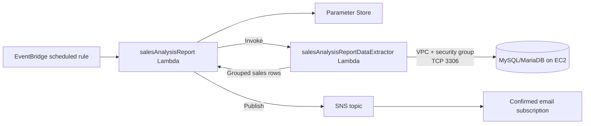

# Lambda sales report workflow: trace every boundary

## Goal

Build a scheduled serverless sales-report path that reads grouped order data from a MySQL-compatible database on an EC2 host and publishes a formatted report through Amazon SNS.

The lab demonstrates a reusable pattern:

```text
EventBridge schedule
  → report Lambda
  → extractor Lambda
  → database on EC2
  → report formatting
  → SNS topic
  → email subscription
```

The transferable lesson is not “create two Lambda functions.” It is to prove the five boundaries independently:

1. **Identity:** Lambda can assume the intended execution role and call its AWS dependencies.
2. **Packaging:** the runtime can load the database client dependency.
3. **Network:** the VPC-attached extractor can reach TCP 3306 on the database host.
4. **Application:** the query returns the expected grouped sales rows.
5. **Delivery:** the report is published and the notification endpoint is confirmed separately.

This repository is a sanitized, reusable reconstruction. Course-provided ZIP packages, credentials, account identifiers, ARNs, public IP addresses, emails, and live resource names are intentionally excluded.

## Architecture



The detailed request path and evidence surfaces are in [`docs/architecture.md`](docs/architecture.md).

## Environment

- AWS Training sandbox
- Region used in the run: `us-west-2`
- Python runtime: `3.9`
- Database: MySQL-compatible database on an EC2 LAMP host
- Dependency: PyMySQL supplied as a Lambda layer
- Functions:
  - `salesAnalysisReportDataExtractor`
  - `salesAnalysisReport`
- Notification: Standard SNS topic with an email subscription
- Schedule: EventBridge scheduled rule using UTC

Use placeholders when adapting this pattern:

```bash
export AWS_REGION="us-west-2"
export EXTRACTOR_FUNCTION="salesAnalysisReportDataExtractor"
export REPORT_FUNCTION="salesAnalysisReport"
export SNS_TOPIC_ARN="arn:aws:sns:${AWS_REGION}:<account-id>:salesAnalysisReportTopic"
```

Do not export credentials or database passwords into shell history. Use the AWS credential mechanism appropriate to the environment.

## Design decisions

### Split extraction from reporting

The extractor owns the database connection and query. The report Lambda owns orchestration, formatting, and notification. This makes failures observable:

- an import or layer error belongs to packaging;
- a timeout before the query belongs to network reachability or database access;
- an empty result may be valid business state;
- a malformed topic ARN belongs to report configuration;
- an SNS publish or email problem belongs to notification delivery.

The split also allows the extractor to be tested before the report path exists.

### Put database configuration in Parameter Store

The function receives or retrieves configuration at runtime instead of committing database values to source. A real implementation should use encrypted parameters or Secrets Manager, scope read access to the exact names, and rotate credentials.

### Use a layer for the client dependency

The PyMySQL layer keeps the deployment package focused on function code. A layer is only a packaging mechanism; runtime, architecture, import path, and handler compatibility still need verification.

### Treat the security group as a network boundary

The extractor was placed in the café VPC and subnet. The database security group needed an inbound TCP 3306 path. The training run used a broad rule to demonstrate reachability; a production design should use a security-group-to-security-group source and keep the database private.

## Implementation

### 1. Inspect execution roles

The report role must be trusted by Lambda and needs permission categories for:

- CloudWatch Logs;
- reading the required Parameter Store values;
- invoking the extractor Lambda;
- publishing to the one SNS topic.

The extractor role must be trusted by Lambda and needs:

- CloudWatch Logs;
- VPC network-interface operations required by a VPC-attached Lambda.

See the example permission boundaries in [`policies/`](policies/).

Trust and permissions answer different questions. A correct trust policy does not grant API permissions, and correct IAM does not create a network route to the database.

### 2. Create the layer

Create a Lambda layer named `pymysqlLibrary`, upload the course-provided `pymysql-v3.zip`, select the compatible Python runtime, and attach version 1 to the extractor.

The course ZIP is not redistributed here. Build or obtain a dependency package through an authorized source and validate its runtime/architecture before deployment.

### 3. Create the extractor

Create the function with the existing extractor role, set the handler, upload the course package, attach the layer, and configure the VPC:

- intended café VPC;
- intended café subnet;
- intended database security group.

Create a disposable test event with the database values directly in the sandbox. Never commit that event JSON or paste it into an issue, README, screenshot, or shell history.

### 4. Verify the dependency path first

Invoke the extractor before testing the report function. A useful read-back is:

```json
{
  "statusCode": 200,
  "body": [
    {
      "product_group_name": "Pastries",
      "product_name": "Croissant",
      "quantity": 3
    }
  ]
}
```

The exact rows depend on the test data. The important evidence is that the function reaches the database and returns the expected schema.

### 5. Create the SNS boundary

Create a Standard topic named `salesAnalysisReportTopic`, set its display name, create an email subscription, and confirm the subscription from the recipient inbox.

Keep the topic ARN in the local AWS environment. The report function should receive it through an environment variable named `topicARN`.

### 6. Create the report function

The training CLI flow used a course-supplied ZIP package. A generic equivalent is:

```bash
aws lambda create-function \
  --function-name "$REPORT_FUNCTION" \
  --runtime python3.9 \
  --zip-file fileb://salesAnalysisReport-v2.zip \
  --handler salesAnalysisReport.lambda_handler \
  --region "$AWS_REGION" \
  --role "<sales-analysis-report-role-arn>"
```

The role ARN placeholder must be resolved locally. Do not replace it with a real ARN in this public repository.

Set the report function environment variable:

```text
Key:   topicARN
Value: arn:aws:sns:<region>:<account-id>:salesAnalysisReportTopic
```

### 7. Add the schedule last

Manually test the report function before enabling a recurring rule. A temporary test expression should be calculated five minutes ahead in UTC:

```text
cron(<minute> <hour> ? * MON-SAT *)
```

The production schedule used for this lab is:

```text
cron(0 20 ? * MON-SAT *)
```

That means 20:00 UTC Monday through Saturday. Re-check the UTC decision against the business timezone and daylight-saving requirements before using it in production.

## Verification

### Observed training-run evidence

The learner completed the workflow in an AWS Training sandbox. The following failures and corrections were observed:

| Boundary | Observation | Correction |
|---|---|---|
| Extractor invocation | Initial invocation timed out after the default 3 seconds. | The database security group was missing TCP 3306; the lab rule was added. |
| Database result | The first successful extractor response returned an empty list. | Café orders were placed, then the function was invoked again. |
| Query result | The extractor returned five grouped product records, including pastries and drinks. | No code change was needed; the database now contained test data. |
| Report configuration | `IndexError: list index out of range` at `arnParts[3]`. | The `topicARN` environment variable was replaced with a complete SNS ARN. |
| Report duration | The corrected report function still timed out at 3 seconds. | Timeout was raised to 10 seconds for the multi-service cold-start path. |
| End-to-end report | The learner reported the final report invocation succeeded. | The scheduled trigger was configured after manual testing. |

This table separates observed behavior from the design claim. It does not include live identifiers or secret values.

### Evidence limits

- Role inspection proves declared trust and policy configuration, not successful runtime authorization.
- A layer count proves attachment, not import compatibility.
- A security-group rule proves a declared ingress path, not database authentication or query correctness.
- A successful extractor invocation proves the function returned data for that input; it does not prove every row is correct.
- SNS publish acceptance is not the same as email delivery. Verify the recipient endpoint separately.
- A configured schedule is not proof that the rule fired. Read the target, invocation log, output, and notification receipt.

## Troubleshooting runbook

### `Task timed out after 3.00 seconds` in the extractor

Check in order:

1. Lambda VPC/subnet/security-group selection.
2. Database security-group inbound TCP 3306 rule.
3. Source restriction and route/NACL behavior.
4. Database host/port and connection timeout.
5. Database credentials and query behavior.

Do not start by changing IAM when the failure is a network timeout.

### `IndexError: list index out of range` at `arnParts[3]`

The report code is parsing the SNS ARN. Inspect the `topicARN` environment variable for:

- missing key;
- empty value;
- topic name instead of ARN;
- Lambda ARN instead of SNS ARN;
- truncated ARN;
- quotes/backticks or whitespace.

The expected shape is:

```text
arn:aws:sns:<region>:<account-id>:salesAnalysisReportTopic
```

### The report times out after the topic ARN is fixed

The report path invokes another Lambda and publishes to SNS. Confirm the function timeout is sufficient for the first invocation and that the report role can invoke the extractor and publish to the topic. Retry once to separate a cold-start timing issue from a persistent dependency failure, then inspect logs.

### The function succeeds but the body is empty

An empty list can be valid: it may mean the query ran successfully against a database with no order rows. Place controlled test data and invoke again. Do not treat an empty business result as a network failure automatically.

## Cost and cleanup

The training sandbox was ended after the run. For a personal or shared AWS account, cleanup is part of the lab:

1. Disable or delete the EventBridge rule.
2. Delete both Lambda functions.
3. Delete the layer versions.
4. Delete the SNS topic and subscription.
5. Remove the temporary database security-group rule.
6. Remove disposable parameters and test orders.
7. Read back the account for remaining functions, rules, topics, layers, and network rules.

Never assume that a successful delete command proves the whole dependency graph is gone. Verify by resource type.

## Production improvements

- Replace broad AWS-managed policies with resource-scoped policies.
- Use security-group-to-security-group ingress for the database.
- Keep database hosts private and use Secrets Manager or encrypted Parameter Store.
- Deploy Lambda across suitable subnets/AZs for the availability requirement.
- Add alarms for errors, timeouts, throttles, duration, and notification failures.
- Make report publication idempotent and account for EventBridge retries.
- Package dependencies through CI with runtime and architecture tests.
- Use structured logs with a correlation ID across the coordinator and extractor.
- Separate schedule configuration from application code and test UTC/timezone behavior.

## What this lab teaches

- Serverless does not remove network design; a VPC-attached Lambda still depends on routes, security groups, and ports.
- IAM authorization and network reachability are separate troubleshooting layers.
- A Lambda layer reduces packaging duplication but introduces compatibility checks.
- Small functions with explicit responsibilities are easier to test and diagnose than one opaque function.
- Evidence should follow the request path: configuration → invocation → dependency → business output → notification.
- Schedules are production controls, not harmless demo settings; use UTC deliberately and clean them up.

## Safety

Run this artifact only in a disposable test environment. Replace all placeholders locally. Never commit `.env` files, AWS credentials, Parameter Store values, database passwords, live ARNs, account IDs, instance IDs, public IPs, or recipient addresses.
